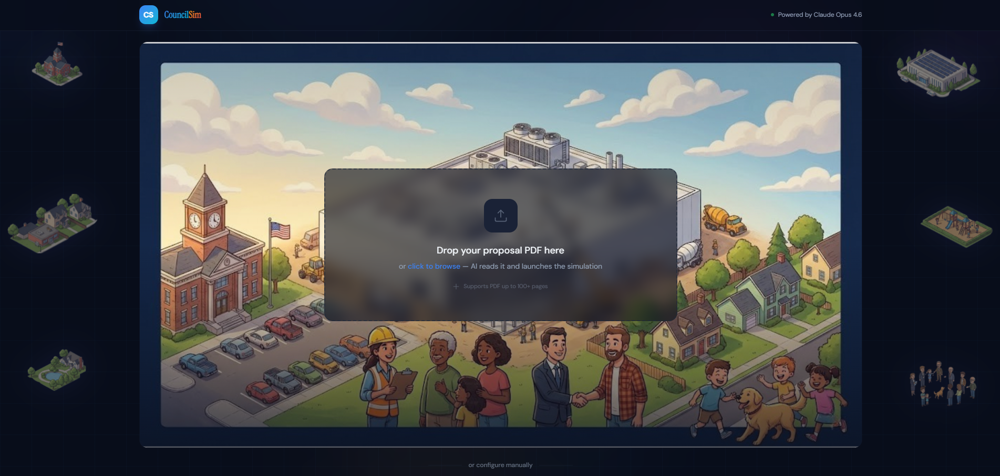

<div align="center">

[](https://claude.ai/claude-code)
[](https://anthropic.com)
[](https://docs.anthropic.com)
[](https://react.dev)
[](https://fastapi.tiangolo.com)
[](https://vercel.com)
[](https://railway.app)
[](LICENSE)

# CouncilSim

**AI-powered city council debate simulator for data center proposals**

*Problem Statement 3: Amplify Human Judgment*

Built for the [Built with Opus 4.6: Claude Code Hackathon](https://cerebralvalley.ai/e/claude-code-hackathon) (Feb 10–16, 2026)

<br />



</div>

---

## The Problem

Over **$64 billion** in data center projects have been blocked or delayed by local opposition. Petitioners walk into city council meetings unprepared for the intensity of community pushback — emotional arguments about water usage, property values, noise, and environmental impact. Critical AI infrastructure isn't getting built.

## The Solution

CouncilSim creates a realistic multi-agent debate simulation where:

- **AI residents** raise the exact concerns your real neighbors will
- **An AI petitioner** defends your proposal with data and empathy
- **An AI council moderator** asks the tough questions
- **Post-debate analysis** scores your approval likelihood and gives you battle-tested rebuttals

Upload a real proposal PDF — the kind found on any city council meeting agenda — and watch five AI personas debate it live. Walk into your next council meeting knowing every concern before it's raised.

**Go from rejected to approved — with confidence.**

---

## Features

- **Multi-agent debate simulation** — 5 AI personas with distinct personalities, concerns, and speaking styles
- **Real-time streaming** — Watch the debate unfold token-by-token via WebSocket
- **5-phase meeting structure** — Opening, Public Comment, Rebuttal, Council Q&A, Deliberation
- **Community research** — Agent scans real Facebook groups and forums for actual resident concerns
- **PDF document upload** — Upload your actual proposal document for AI analysis
- **Approval scoring** — Weighted 0-100 score with "Likely Approved" / "Uncertain" / "Likely Denied" labels
- **Actionable rebuttals** — Specific responses with supporting data for real meetings
- **Strengths & weaknesses** — Full breakdown of your proposal's strongest and weakest points
- **Transcript export** — Download the full debate as markdown

---

## Architecture

### Hybrid AI Approach

CouncilSim uses a **hybrid architecture** that leverages both the Claude Agent SDK and the direct Anthropic API:

**Claude Agent SDK** (intelligence layer):
- **Persona Agent** — Researches the city, creates locally-grounded debate personas (Opus 4.6)
- **Document Agent** — Extracts structured data from uploaded proposals (Sonnet 4.5)
- **Analysis Agent** — Scores approval likelihood, identifies key arguments, generates rebuttals (Opus 4.6)
- **Community Research Agent** — Scans real social media for actual community sentiment (Opus 4.6)

**Anthropic API** (debate engine):
- Each persona gets a rich system prompt and the growing transcript as context
- Tokens stream via WebSocket to the frontend in real-time
- Temperature 0.85 for natural speech variety

**3 Custom MCP Tools:**
- `research_city` — Structures city demographic queries
- `parse_proposal_document` — Extracts structured proposal data
- `compute_approval_score` — Weighted scoring formula with 6 debate factors

### Tech Stack

| Layer | Technology |
|-------|-----------|
| Backend | Python 3.10 / FastAPI / Uvicorn |
| AI — Agents | Claude Agent SDK (4 subagents + 3 MCP tools) |
| AI — Debate | Anthropic Python SDK / Claude Opus 4.6 |
| Frontend | React 19 / TypeScript / Vite / Tailwind CSS v4 |
| Real-time | WebSockets (FastAPI native) |
| Animations | Framer Motion |
| Deployment | Railway (backend) + Vercel (frontend) |

### Project Structure

```
├── backend/
│   ├── main.py                     # FastAPI app entry point
│   ├── config.py                   # Settings (pydantic-settings)
│   ├── api/
│   │   ├── routes.py               # REST: POST /simulations, GET /simulations/:id
│   │   └── websocket.py            # WebSocket: /ws/simulation/:id
│   ├── agents/
│   │   ├── orchestrator.py         # Coordinates 4 Agent SDK subagents
│   │   ├── persona_agent.py        # Persona generation (Opus 4.6)
│   │   ├── document_agent.py       # Document analysis (Sonnet 4.5)
│   │   ├── analysis_agent.py       # Debate analysis (Opus 4.6)
│   │   ├── community_research.py   # Real community sentiment (Opus 4.6)
│   │   └── tools/                  # Custom MCP tools
│   ├── debate/
│   │   ├── engine.py               # 5-phase debate orchestration
│   │   ├── personas.py             # System prompt templates
│   │   ├── turns.py                # Streaming turn generation
│   │   └── transcript.py           # Context management
│   ├── models/                     # Pydantic data models
│   └── services/
│       ├── simulation_manager.py   # In-memory state store
│       └── stream_manager.py       # WebSocket broadcast
├── frontend/
│   └── src/
│       ├── components/
│       │   ├── landing/            # LandingPage with PDF upload
│       │   ├── chamber/            # CouncilChamber, TranscriptFeed, SpeakerPanel
│       │   └── results/            # ResultsDashboard, ApprovalMeter, TranscriptExport
│       ├── hooks/useSimulation.ts  # WebSocket + state management
│       └── types/                  # TypeScript types mirroring backend
├── Dockerfile
├── railway.toml
└── CLAUDE.md
```

---

## Setup

### Prerequisites

- Python 3.10+
- Node.js 18+
- Anthropic API key

### Backend

```bash
cd backend
pip install -r requirements.txt

# Set environment variables
cp ../.env.example ../.env
# Edit .env and add your ANTHROPIC_API_KEY

# Run the backend (from project root)
cd ..
uvicorn backend.main:app --reload
```

The backend runs at `http://localhost:8000`.

### Frontend

```bash
cd frontend
npm install
npm run dev
```

The frontend runs at `http://localhost:5173`.

### Environment Variables

| Variable | Description | Default |
|----------|-------------|---------|
| `ANTHROPIC_API_KEY` | Your Anthropic API key | Required |
| `ENVIRONMENT` | `development` or `production` | `development` |
| `FRONTEND_URL` | Frontend URL for CORS | `http://localhost:5173` |
| `VITE_API_BASE_URL` | Backend API URL (frontend) | `http://localhost:8000` |
| `VITE_WS_BASE_URL` | Backend WebSocket URL (frontend) | `ws://localhost:8000` |

---

## Deployment

### Backend (Railway)

1. Connect your GitHub repo to Railway
2. Set `ANTHROPIC_API_KEY` environment variable
3. Railway will auto-detect the Dockerfile

### Frontend (Vercel)

1. Import the `frontend/` directory to Vercel
2. Set `VITE_API_BASE_URL` and `VITE_WS_BASE_URL` to your Railway URL
3. Vercel will auto-detect Vite

---

## How It Works

1. **Upload a proposal PDF** — Drop in a real data center proposal from a city council agenda
2. **Agents research the community** — Scans Facebook groups, forums, and local data for real concerns
3. **Agents analyze the document** — Extracts every detail from the proposal
4. **5-phase debate simulation** — AI personas debate live, streaming in real-time
5. **Strategic analysis** — Approval score, opposition arguments, rebuttals, strengths & weaknesses
6. **Walk in prepared** — Know every concern before it's raised

---

## Hackathon Context

**Problem Statement 3: Amplify Human Judgment** — CouncilSim helps petitioners prepare for city council meetings without replacing human decision-making. It surfaces the arguments they'll face, tests their responses, and provides data-backed rebuttals — dramatically sharpening preparation while keeping humans in the loop.

**Built with Claude Code**: The entire codebase — backend, frontend, agent orchestration, MCP tools, and even the demo video (built with Remotion) — was written by Claude Opus 4.6 in Claude Code. From architecture decisions to pixel-level UI polish, Claude Code was the sole development environment.

**Why Opus 4.6**: The multi-agent debate requires nuanced persona management (each agent has conflicting goals), deep contextual reasoning (building on previous arguments), and strategic analysis (post-debate recommendations). Opus 4.6 powers the persona generation, community research, debate turns, and analysis — the entire intelligence layer.

**Real-world impact**: Data centers are critical infrastructure for AI. Anthropic itself [committed to covering 100% of consumer electricity price increases](https://www.anthropic.com/news/covering-electricity-price-increases) from data centers (Feb 2026). CouncilSim directly helps get that infrastructure built by preparing petitioners for the toughest questions.

---

## License

MIT License

---

<div align="center">

**Built entirely with [Claude Code](https://claude.ai/claude-code)** — every line of backend, frontend, and video production code was written by Claude Opus 4.6 in Claude Code.

*Go from rejected to approved — with confidence.*

</div>
